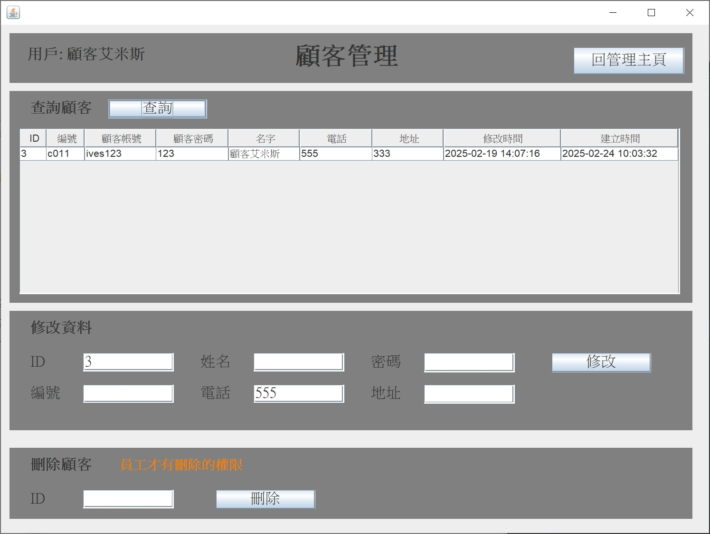

# JavaSwingMySQLShoppingMallEmploye
Java Swing jdbc搭配MySQL 建立簡易商城系統，包含員工管理、會員管理，產品管理、訂單管理

## 使用技術
- java jdk11
- Swing
- MySQL 8.0.41
- eclipse windowbuilder
- dao pattern
- jdbc
- maven

# 使用方式

## 前置條件

- 安裝mysql8.0.41
[MySQL Community Downloads](https://dev.mysql.com/downloads/installer/)

- 安裝jdk11
[jdk-11.0.25_windows-x64_bin](https://www.oracle.com/tw/java/technologies/javase/jdk11-archive-downloads.html)

## 下載本專案對應檔案

下載SQL import數據庫及表格，在sql資料夾


下載OrderAppV500.jar

[OrderAppV500.jar](https://github.com/IvesShe/JavaMavenSwingMySQLShoppingMallEmployee/blob/main/OrderAppV500.jar)


windows環境直接雙擊OrderAppV500.jar，即可執行

mac環境要開啟終端機，輸入

```shell
java -jar OrderAppV500.jar
```

# 功能樹狀結構


```tree
簡易商城系統 (App 主頁)
├── 前台登入
│   ├── 顧客登入畫面
│   │   ├── 進入顧客管理
│   │   │   ├── 修改顧客資料
│   │   │   ├── 新增訂單
│   │   │   │   ├── 提交訂單
│   │   │   │   └── 輸出EXCEL
│   │   │   ├── 修改訂單
│   │   │   └── 登出
│   ├── 前往註冊
│   └── 前往APP主畫面
├── 後台登入
│   ├── 員工登入畫面
│   │   ├── 進入員工管理
│   │   │   ├── 新增員工
│   │   │   ├── 管理員工
│   │   │   │   ├── 查詢員工
│   │   │   │   ├── 修改資料
│   │   │   │   ├── 刪除員工
│   │   │   │   └── 回管理主頁
│   │   │   ├── 新增產品
│   │   │   ├── 修改產品
│   │   │   │   ├── 查詢產品
│   │   │   │   ├── 修改資料
│   │   │   │   ├── 刪除產品
│   │   │   │   └── 回管理主頁
│   │   │   ├── 修改顧客資料
│   │   │   │   ├── 查詢顧客
│   │   │   │   ├── 修改資料
│   │   │   │   ├── 刪除顧客
│   │   │   │   └── 回管理主頁
│   │   │   ├── 修改訂單
│   │   │   │   ├── 查詢訂單
│   │   │   │   ├── 詳細報表 (聯表查詢)
│   │   │   │   │   ├── 查詢詳細報表
│   │   │   │   │   └── 回訂單管理
│   │   │   │   ├── 修改資料
│   │   │   │   ├── 刪除訂單
│   │   │   │   └── 回管理主頁
│   │   │   ├── 熱門產品圖表(JFreeChart)
│   │   │   └── 登出
│   └── 前往APP主畫面
└── 離開
```


# APP主頁畫面


# 前台-顧客登入畫面

admin帳號(帳號admin,密碼123)


# 前台-登入成功歡迎畫面


# 前台-顧客管理主頁



# 前台-顧客管理頁面


# 前台-新增訂單頁面


# 前台-訂單輸出EXCEL畫面


# 前台-訂單管理畫面


# 前台-訂單詳細報表(聯表查詢)


# 後台-員工登入畫面


# 後台-員工管理主頁


# 後台-新增員工頁面


# 後台-員工管理頁面


# 後台-新增產品頁面


# 後台-產品管理頁面


# 後台-顧客管理頁面


# 後台-訂單管理頁面


# 後台-訂單詳細報表(聯表查詢)


# 後台-熱門產品報表(JFreeChart)


# MySQL

帳號root
密碼1234

## 會員表單


## 訂單表單


# Model
<h3> 原始碼在src資料夾，僅供參考</h1>
## Member

# 參考資料

https://www.w3schools.com/sql/sql_foreignkey.asp

