# JavaSwingMySQLShoppingMallEmploye
Java Swing jdbc搭配MySQL 建立簡易商城系統，包含員工管理、會員管理，產品管理、訂單管理

## 使用技術
- java jdk11
- Swing
- MySQL 8.0.41
- eclipse windowbuilder
- dao pattern
- jdbc

# 使用方式

## 前置條件

- 安裝mysql8.0.41
[MySQL Community Downloads](https://dev.mysql.com/downloads/installer/)

- 安裝jdk11
[jdk-11.0.25_windows-x64_bin](https://www.oracle.com/tw/java/technologies/javase/jdk11-archive-downloads.html)

## 下載本專案對應檔案

下載SQL import數據庫及表格，在sql資料夾

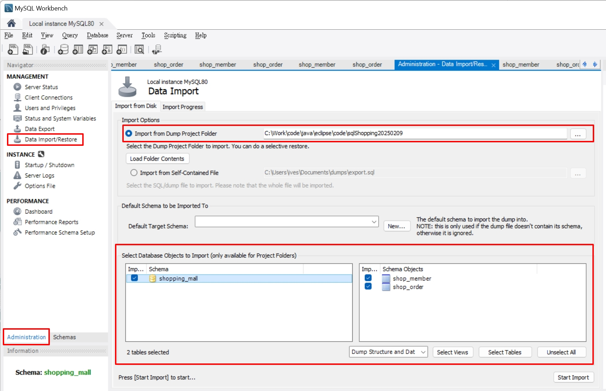

下載OrderAppV500.jar

[OrderAppV500.jar](https://github.com/IvesShe/JavaSwingMySQLShoppingMall/blob/main/OrderAppV400.jar)

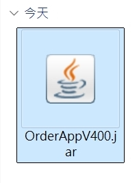

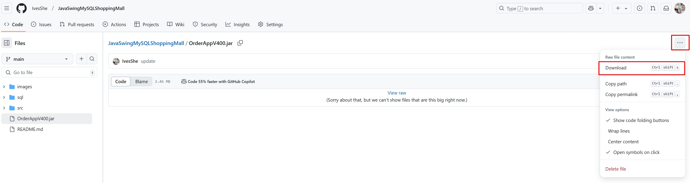

windows環境直接雙擊OrderAppV400.jar，即可執行

mac環境要開啟終端機，輸入

```shell
java -jar OrderAppV500.jar
```

# 功能樹狀結構

簡易商城系統 (App 主頁)

├── 前台登入
│   ├── 顧客登入畫面
│   │   ├── 進入顧客管理
│   │   │   ├── 修改顧客資料
│   │   │   ├── 新增訂單
│   │   │   ├── 修改訂單
│   │   │   └── 登出
│
├── 後台登入
│   ├── 顧客登入畫面
│   │   ├── 進入員工管理
│   │   │   ├── 新增員工
│   │   │   ├── 管理員工
│   │   │   │   ├── 查詢員工
│   │   │   │   ├── 修改資料
│   │   │   │   ├── 刪除員工
│   │   │   │   └── 回管理主頁
│   │   │   ├── 新增產品
│   │   │   ├── 修改產品
│   │   │   │   ├── 查詢產品
│   │   │   │   ├── 修改資料
│   │   │   │   ├── 刪除產品
│   │   │   │   └── 回管理主頁
│   │   │   ├── 修改顧客資料
│   │   │   │   ├── 查詢顧客
│   │   │   │   ├── 修改資料
│   │   │   │   ├── 刪除顧客
│   │   │   │   └── 回管理主頁
│   │   │   ├── 修改訂單
│   │   │   │   ├── 查詢訂單
│   │   │   │   ├── 詳細報表(聯表查詢)
│   │   │   │   │   ├── 查詢詳細報表
│   │   │   │   │   └── 回訂單管理
│   │   │   │   ├── 修改資料
│   │   │   │   ├── 刪除訂單
│   │   │   │   └── 回管理主頁
│   │   │   ├── 熱門產品圖表
│   │   │   └── 登出
└── 離開

## 前台登入
- **顧客登入畫面**
  - 進入顧客管理
    - 修改顧客資料
    - 新增訂單
    - 修改訂單
    - 登出

## 後台登入
- **顧客登入畫面**
  - 進入員工管理
    - 新增員工
    - 管理員工
      - 查詢員工
      - 修改資料
      - 刪除員工
      - 回管理主頁
    - 新增產品
    - 修改產品
      - 查詢產品
      - 修改資料
      - 刪除產品
      - 回管理主頁
    - 修改顧客資料
      - 查詢顧客
      - 修改資料
      - 刪除顧客
      - 回管理主頁
    - 修改訂單
      - 查詢訂單
      - 詳細報表 (聯表查詢)
        - 查詢詳細報表
        - 回訂單管理
      - 修改資料
      - 刪除訂單
      - 回管理主頁
    - 熱門產品圖表
    - 登出


簡易商城系統 (App 主頁)
├── 前台登入
│   ├── 顧客登入畫面
│   │   ├── 進入顧客管理
│   │   │   ├── 修改顧客資料
│   │   │   ├── 新增訂單
│   │   │   ├── 修改訂單
│   │   │   └── 登出
│
├── 後台登入
│   ├── 顧客登入畫面
│   │   ├── 進入員工管理
│   │   │   ├── 新增員工
│   │   │   ├── 管理員工
│   │   │   │   ├── 查詢員工
│   │   │   │   ├── 修改資料
│   │   │   │   ├── 刪除員工
│   │   │   │   └── 回管理主頁
│   │   │   ├── 新增產品
│   │   │   ├── 修改產品
│   │   │   │   ├── 查詢產品
│   │   │   │   ├── 修改資料
│   │   │   │   ├── 刪除產品
│   │   │   │   └── 回管理主頁
│   │   │   ├── 修改顧客資料
│   │   │   │   ├── 查詢顧客
│   │   │   │   ├── 修改資料
│   │   │   │   ├── 刪除顧客
│   │   │   │   └── 回管理主頁
│   │   │   ├── 修改訂單
│   │   │   │   ├── 查詢訂單
│   │   │   │   ├── 詳細報表 (聯表查詢)
│   │   │   │   │   ├── 查詢詳細報表
│   │   │   │   │   └── 回訂單管理
│   │   │   │   ├── 修改資料
│   │   │   │   ├── 刪除訂單
│   │   │   │   └── 回管理主頁
│   │   │   ├── 熱門產品圖表
│   │   │   └── 登出
│
└── 離開    

## 離開

# 登入畫面

一般帳號只能查到自己的訂單, admin帳號可以查到所有的訂單(帳號admin,密碼123)

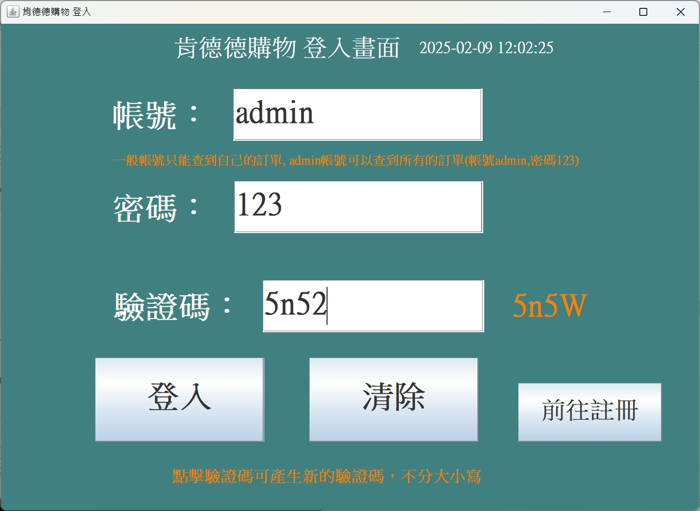

# 登入成功歡迎畫面

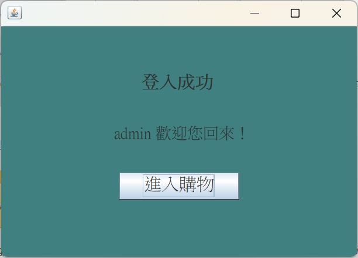

# 登入失敗畫面

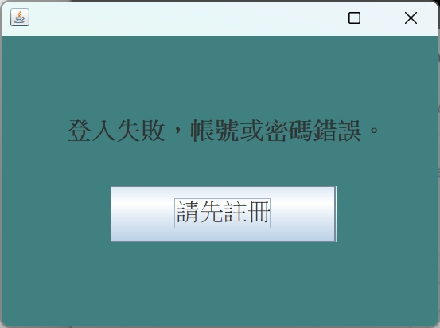

# 訂單主頁

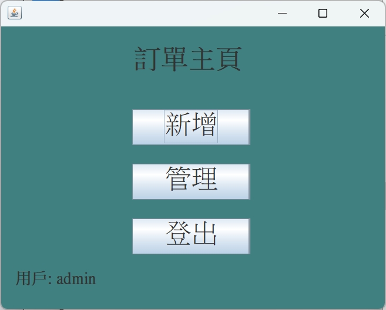

# 訂單新增畫面

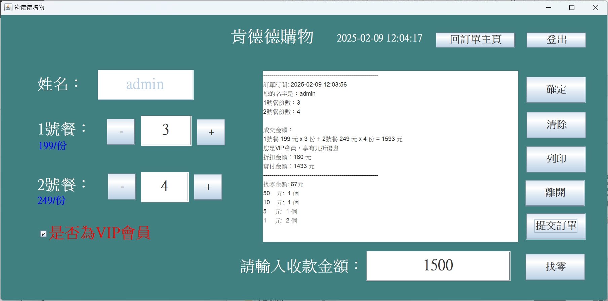

# 訂單管理畫面

## admin帳號可以查到所有的訂單
包含更新時間及建立時間

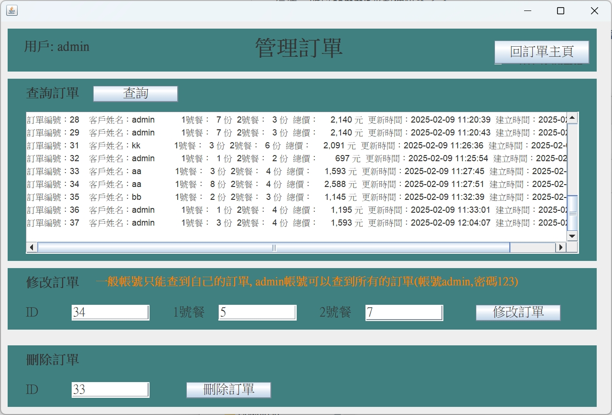

## 一般帳號只能查到自己的訂單
包含更新時間及建立時間

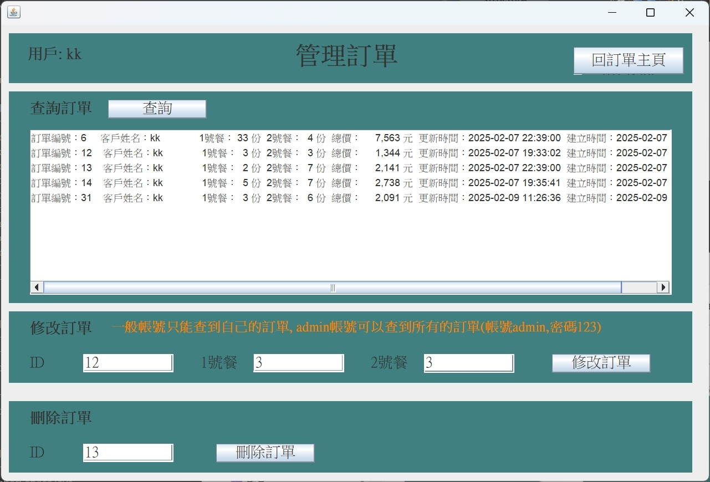

# 註冊畫面

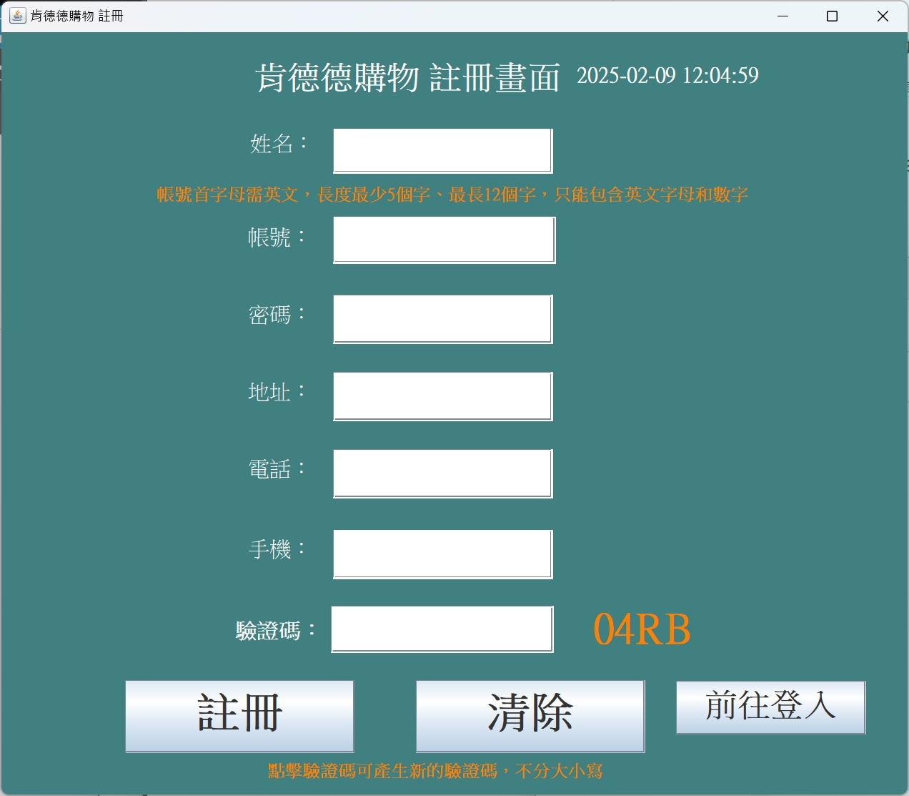

# 註冊失敗畫面

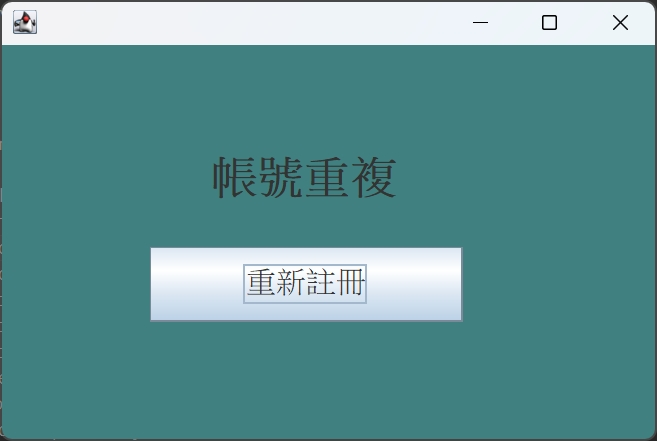

# MySQL

帳號root
密碼1234

## 會員表單

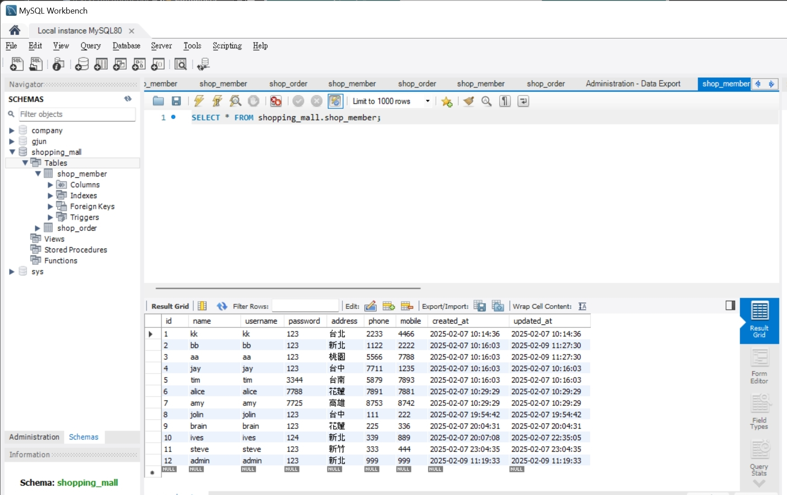

## 訂單表單

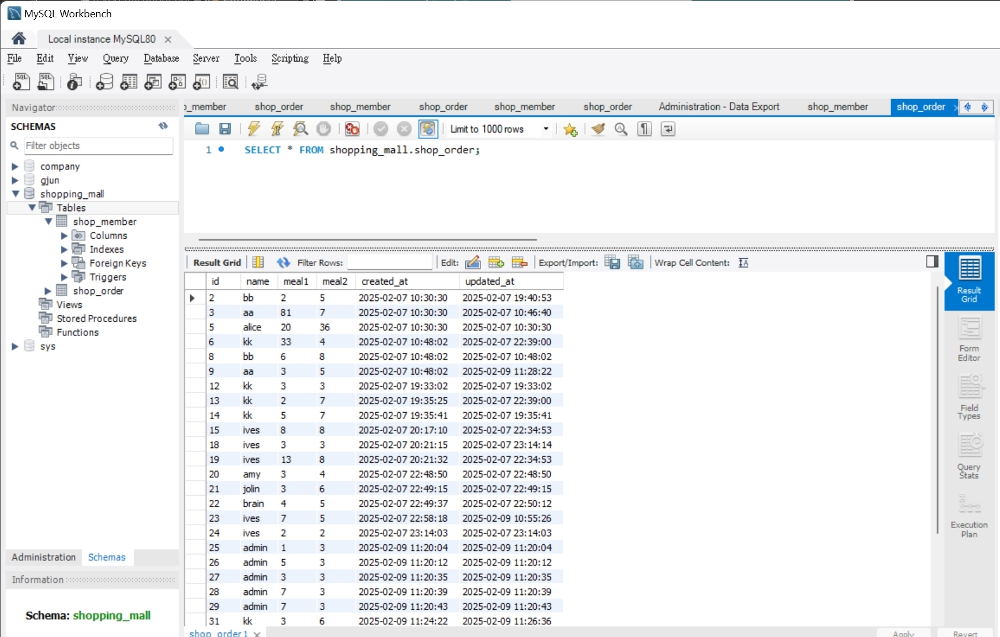

# Model
<h3> 原始碼在src資料夾，僅供參考</h1>
## Member

# 參考資料

https://www.w3schools.com/sql/sql_foreignkey.asp

