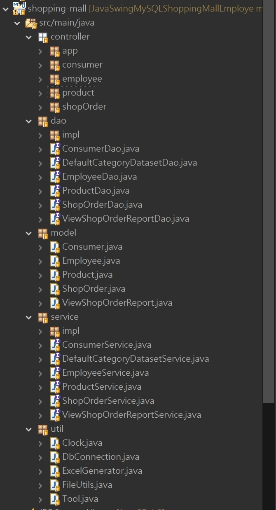
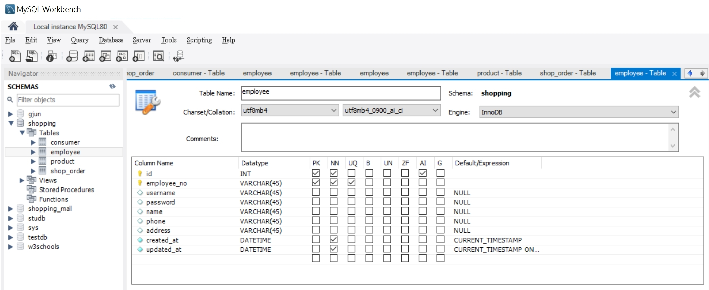

# JavaMavenSwingMySQLShoppingMallEmploye
Java Swing jdbc搭配MySQL 建立簡易商城系統，包含員工管理、會員管理，產品管理、訂單管理、報表輸出，使用Maven作依賴管理

## 使用技術
- java jdk11
- Swing
- MySQL 8.0.41
- eclipse windowbuilder
- dao pattern
- jdbc
- maven

# 使用方式

## 前置條件

- 安裝mysql8.0.41
[MySQL Community Downloads](https://dev.mysql.com/downloads/installer/)

- 安裝jdk11
[jdk-11.0.25_windows-x64_bin](https://www.oracle.com/tw/java/technologies/javase/jdk11-archive-downloads.html)

## 下載本專案對應檔案

下載SQL import數據庫及表格，在sql資料夾


下載OrderAppV500.jar

[OrderAppV500.jar](https://github.com/IvesShe/JavaMavenSwingMySQLShoppingMallEmployee/blob/main/OrderAppV500.jar)


windows環境直接雙擊OrderAppV500.jar，即可執行

mac環境要開啟終端機，輸入

```shell
java -jar OrderAppV500.jar
```

# 功能樹狀結構


```tree
簡易商城系統 (App 主頁)
├── 前台登入
│   ├── 顧客登入畫面
│   │   ├── 進入顧客管理
│   │   │   ├── 修改顧客資料
│   │   │   ├── 新增訂單
│   │   │   │   ├── 提交訂單
│   │   │   │   └── 輸出EXCEL
│   │   │   ├── 修改訂單
│   │   │   └── 登出
│   ├── 前往註冊
│   └── 前往APP主畫面
├── 後台登入
│   ├── 員工登入畫面
│   │   ├── 進入員工管理
│   │   │   ├── 新增員工
│   │   │   ├── 管理員工
│   │   │   │   ├── 查詢員工
│   │   │   │   ├── 修改資料
│   │   │   │   ├── 刪除員工
│   │   │   │   └── 回管理主頁
│   │   │   ├── 新增產品
│   │   │   ├── 修改產品
│   │   │   │   ├── 查詢產品
│   │   │   │   ├── 修改資料
│   │   │   │   ├── 刪除產品
│   │   │   │   └── 回管理主頁
│   │   │   ├── 修改顧客資料
│   │   │   │   ├── 查詢顧客
│   │   │   │   ├── 修改資料
│   │   │   │   ├── 刪除顧客
│   │   │   │   └── 回管理主頁
│   │   │   ├── 修改訂單
│   │   │   │   ├── 查詢訂單
│   │   │   │   ├── 詳細報表 (聯表查詢)
│   │   │   │   │   ├── 查詢詳細報表
│   │   │   │   │   └── 回訂單管理
│   │   │   │   ├── 修改資料
│   │   │   │   ├── 刪除訂單
│   │   │   │   └── 回管理主頁
│   │   │   ├── 熱門產品圖表(JFreeChart)
│   │   │   └── 登出
│   └── 前往APP主畫面
└── 離開
```

# 目錄結構

採MVC+dao pattern 構



# SQL表 

## 顧客表


## 員工表



## 產品表


## 訂單表


## 訂單詳情表(View)


語法
```sql
select
shopping.shop_order.shop_order_no,
shopping.consumer.consumer_name,
shopping.consumer.phone,
shopping.consumer.address,
shopping.employee.name as employee_name,
shopping.product.product_name,
shopping.shop_order.amount,
shopping.shop_order.amount*shopping.product.price total_sum
from shopping.shop_order 
inner join shopping.consumer on shopping.shop_order.consumer_no=shopping.consumer.consumer_no
inner join shopping.employee on shopping.shop_order.employee_no=shopping.employee.employee_no
inner join shopping.product on shopping.shop_order.product_no=shopping.product.product_no
order by shopping.shop_order.id;
```


## 熱門產品報表(JFreeChart資料源)


語法
```sql
SELECT 
    so.product_no, 
    p.product_name, 
    SUM(so.amount) as total
FROM shopping.shop_order AS so
INNER JOIN shopping.product AS p 
    ON so.product_no = p.product_no
GROUP BY so.product_no, p.product_name
ORDER BY SUM(so.amount) DESC;
```

## 外鍵約束

表採外鍵約束，JAVA程式碼裡也加入邏輯判斷


```sql
-- 增加外鍵fk_shop_order_product
ALTER TABLE shopping.shop_order 
ADD CONSTRAINT fk_shop_order_product 
FOREIGN KEY (product_no) 
REFERENCES shopping.product(product_no)
ON DELETE RESTRICT 
ON UPDATE CASCADE;

-- 增加外鍵fk_shop_order_employee
ALTER TABLE shopping.shop_order 
ADD CONSTRAINT fk_shop_order_employee 
FOREIGN KEY (employee_no) 
REFERENCES shopping.employee(employee_no)
ON DELETE RESTRICT 
ON UPDATE CASCADE;

-- 增加外鍵fk_shop_order_consumer
ALTER TABLE shopping.shop_order 
ADD CONSTRAINT fk_shop_order_consumer 
FOREIGN KEY (consumer_no) 
REFERENCES shopping.consumer(consumer_no)
ON DELETE RESTRICT 
ON UPDATE CASCADE;

```

```java
// 已在訂單裡的員工編號不能被修改
List<ShopOrder> shopOrderList = shopOrderServiceImpl.findByConsumerNo(consumer.getConsumerNo());
System.out.println(shopOrderList);
if(shopOrderList.size()>0) {
    JOptionPane.showMessageDialog(null, "已在訂單裡的顧客編號不能被修改，請重新輸入。", "錯誤", JOptionPane.ERROR_MESSAGE);
    return;
}

// 已在訂單裡的顧客不能被刪除
List<ShopOrder> shopOrderList = shopOrderServiceImpl.findByConsumerNo(consumer.getConsumerNo());
System.out.println(shopOrderList);
if(shopOrderList.size()>0) {
    JOptionPane.showMessageDialog(null, "已在訂單裡的顧客不能被刪除，請重新輸入。", "錯誤", JOptionPane.ERROR_MESSAGE);
    return;
}


// 已在訂單裡的員工編號不能被修改
List<ShopOrder> shopOrderList = shopOrderServiceImpl.findByEmployeeNo(employee.getEmployeeNo());
System.out.println(shopOrderList);
if(shopOrderList.size()>0) {
    JOptionPane.showMessageDialog(null, "已在訂單裡的員工編號不能被修改，請重新輸入。", "錯誤", JOptionPane.ERROR_MESSAGE);
    return;
}
					

// 已在訂單裡的員工不能被刪除
List<ShopOrder> shopOrderList = shopOrderServiceImpl.findByEmployeeNo(employee.getEmployeeNo());
System.out.println(shopOrderList);
if(shopOrderList.size()>0) {
    JOptionPane.showMessageDialog(null, "已在訂單裡的員工不能被刪除，請重新輸入。", "錯誤", JOptionPane.ERROR_MESSAGE);
    return;
}


// 已在訂單裡的產品編號不能被修改
List<ShopOrder> shopOrderList = shopOrderServiceImpl.findByProductNo(product.getProductNo());
System.out.println(shopOrderList);
if(shopOrderList.size()>0) {
    JOptionPane.showMessageDialog(null, "已在訂單裡的產品編號不能被修改，請重新輸入。", "錯誤", JOptionPane.ERROR_MESSAGE);
    return;
}


// 已在訂單裡的產品不能被刪除
List<ShopOrder> shopOrderList = shopOrderServiceImpl.findByProductNo(product.getProductNo());
System.out.println(shopOrderList);
if(shopOrderList.size()>0) {
    JOptionPane.showMessageDialog(null, "已在訂單裡的產品不能被刪除，請重新輸入。", "錯誤", JOptionPane.ERROR_MESSAGE);
    return;
}


```

# pom.xml


```xml
<project xmlns="http://maven.apache.org/POM/4.0.0" xmlns:xsi="http://www.w3.org/2001/XMLSchema-instance" xsi:schemaLocation="http://maven.apache.org/POM/4.0.0 https://maven.apache.org/xsd/maven-4.0.0.xsd">
  <modelVersion>4.0.0</modelVersion>
  <groupId>com.ivesshe</groupId>
  <artifactId>shopping-mall</artifactId>
  <version>0.0.1-SNAPSHOT</version>
  
  <dependencies>
  	<!-- https://mvnrepository.com/artifact/com.mysql/mysql-connector-j -->
	<dependency>
		<groupId>com.mysql</groupId>
		<artifactId>mysql-connector-j</artifactId>
		<version>8.0.33</version>
	</dependency>

  	<!-- Apache POI 基本庫(EXCEL) -->
    <dependency>
        <groupId>org.apache.poi</groupId>
        <artifactId>poi-ooxml</artifactId>
        <version>5.2.3</version>
    </dependency>
    
    <!-- Log4j API -->
    <dependency>
        <groupId>org.apache.logging.log4j</groupId>
        <artifactId>log4j-api</artifactId>
        <version>2.20.0</version>  <!-- 請使用最新版本 -->
    </dependency>

    <!-- Log4j 核心（必須） -->
    <dependency>
        <groupId>org.apache.logging.log4j</groupId>
        <artifactId>log4j-core</artifactId>
        <version>2.20.0</version>
    </dependency>

  	<!-- JUnit 4 -->
    <dependency>
        <groupId>junit</groupId>
        <artifactId>junit</artifactId>
        <version>4.13.2</version>
        <scope>test</scope>
    </dependency>
    

    <!-- JFreeChart -->    
    <dependency>
	    <groupId>org.jfree</groupId>
	    <artifactId>jfreechart</artifactId>
    	<version>1.5.3</version>
	</dependency>
	
	
	<dependency>
	    <groupId>org.jfree</groupId>
	    <artifactId>jcommon</artifactId>
	    <version>1.0.24</version>
	</dependency>

  
  </dependencies> 
</project>

```


# APP主頁畫面


# 前台-顧客登入畫面


# 前台-登入成功歡迎畫面


# 前台-顧客管理主頁


# 前台-顧客管理頁面


# 前台-新增訂單頁面


# 前台-訂單輸出EXCEL畫面


# 前台-訂單管理畫面


# 前台-訂單詳細報表(聯表查詢)


# 後台-員工登入畫面


# 後台-員工管理主頁


# 後台-新增員工頁面


# 後台-員工管理頁面


# 後台-新增產品頁面


# 後台-產品管理頁面


# 後台-顧客管理頁面


# 後台-訂單管理頁面


# 後台-訂單詳細報表(聯表查詢)


# 後台-熱門產品報表(JFreeChart)


# MySQL

帳號root
密碼1234


# SRC
<h3> 原始碼在src\shopping-mall資料夾，僅供參考</h1>


# 參考資料

https://www.w3schools.com/sql/sql_foreignkey.asp

